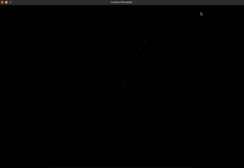

# Lorenz Attractor in 2D with Pygame

## Overview
This project visualizes a 2D projection of the Lorenz attractor using Pygame. The Lorenz attractor is a set of chaotic solutions to the Lorenz system, a system of differential equations originally developed to model atmospheric convection.

## Features
- Real-time visualization of the Lorenz attractor.
- Adjustable parameters for the Lorenz system (sigma, rho, beta).
- User-friendly controls for pausing, resetting, and modifying the simulation.
- Cross-platform compatibility via Pygame.

## Requirements
- Python 3.7+
- Pygame 2.0+

## Installation
1. Clone this repository:
   ```bash
   git clone https://github.com/your-username/lorenz-attractor-2d
   cd lorenz-attractor-2d
   ```
2. Install the required dependencies:
   ```bash
   pip install pygame
   ```

## Usage
Run the simulation with:
```bash
python main.py
```

### Controls
- **P**: Pause/Resume the simulation
- **R**: Reset the simulation
- **Up/Down Arrow Keys**: Zoom in/out

## Lorenz System Equations
The Lorenz system is defined by the following equations:
\[
\begin{aligned}
    \frac{dx}{dt} &= \sigma(y - x) \\
    \frac{dy}{dt} &= x(\rho - z) - y \\
    \frac{dz}{dt} &= xy - \beta z
\end{aligned}
\]
For this 2D projection, we use only \(x\) and \(y\).

### Default Parameters
- Sigma (\(\sigma\)): 10
- Rho (\(\rho\)): 28
- Beta (\(\beta\)): 8/3

These parameters can be modified in the `config.py` file.

## File Structure
```
lorenz-attractor-2d/
├── main.py           # Entry point for the application
├── lorenz.py         # Contains the Lorenz attractor calculations
├── config.py         # Configuration for parameters and settings
├── utils.py          # Helper functions
├── README.md         # Project documentation
```

## Customization
Modify the parameters in `config.py` to explore different behaviors of the Lorenz attractor:
```python
SIGMA = 10
RHO = 28
BETA = 8 / 3
INITIAL_STATE = (1,0,0)
TIME_STEP = 0.01
```

## Demo


## Future Enhancements
- Add 3D visualization support.
- Allow dynamic parameter adjustment through the GUI.
- Export attractor data to CSV for further analysis.

## License
This project is licensed under the MIT License. See `LICENSE` for details.

## Acknowledgments
- Edward Lorenz for his pioneering work on chaos theory.
- The Pygame community for their excellent game development library.

---
Happy exploring the chaos of the Lorenz attractor!

